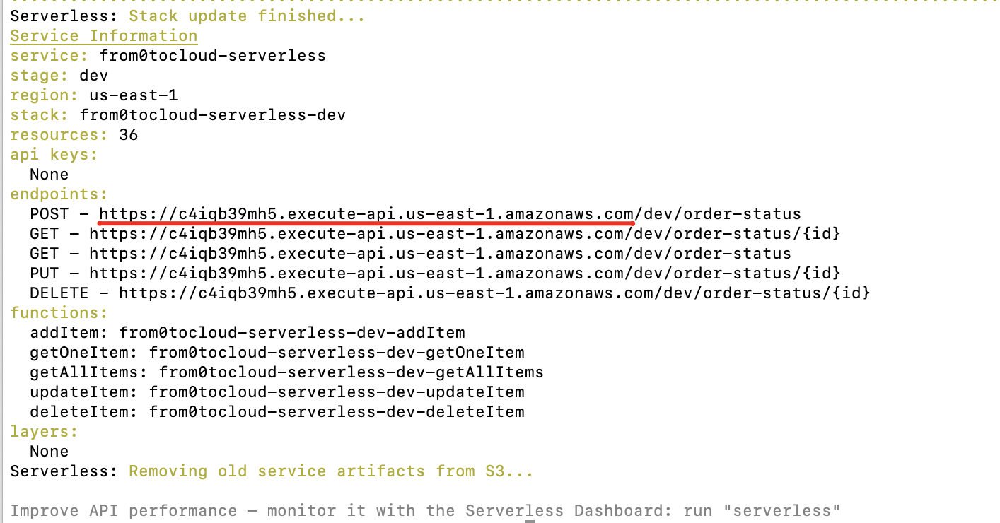
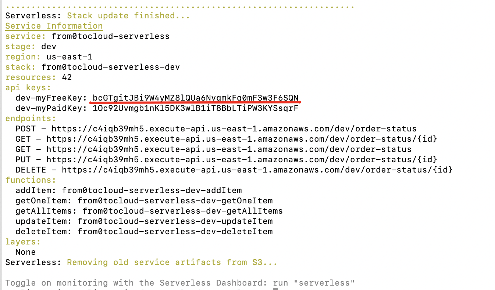
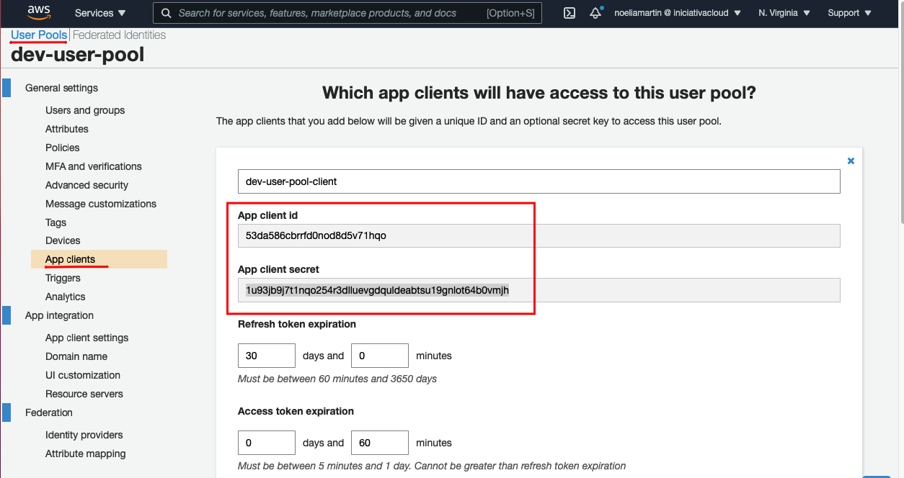

# From0tocloud Serverless AWS
En este repositorio se encuentran todos los componentes cloud-native necesarios para añadir una nueva funcionalidad, modificar el estado del pedido, en la aplicación de ejemplo cloud-friendly.

Esta aplicación utiliza diferentes servicios de AWS para generar esta nueva funcionalidad que son:
- **AWS DynamoDB** como BBDD para almacenar el estado del pedido.
- **AWS Lambda** como capa de servicios serverless para la ejecución de la lógica de negocio de modificación de un pedido.
- **AWS API Gateway** como capa de control para disponibilizar un único punto de ejecución y configurar en el políticas de control de acceso y de throttling. 
- **Cognito** como sistema de autorización para controlar el accceso a los servicios a traves de OAuth 2.0 con el grant-type client-credentials.

## Prerequisitos
1. [Node JS](https://docs.npmjs.com/downloading-and-installing-node-js-and-npm)
2. [Serverless Framework](https://www.npmjs.com/package/serverless)
3. Cuenta en [AWS](https://aws.amazon.com/es/resources/create-account/)

La configuración de la aplicación se lleva a cabo en diferentes pasos que son los siguientes:
## Step 1
Este paso crea y configura los siguientes compomentes:

| **Componente** | **Nombre** | **Función** |
| ------ | ------ | ------ |
| **DynamoDB** | dev-from0tocloud-serverless | Tabla en la que se almacena el estado del pedido. |
| **Lambdas** | **addItem**: from0tocloud-serverless-dev-addItem | Inserta un nuevo estado del pedido con el estado inicial "RECIBIDO". |
|  | **getOneItem**: from0tocloud-serverless-dev-getOneItem | Retorna el estado de un pedido a partir de su identificador (id). |
|  | **getAllItem**s: from0tocloud-serverless-dev-getAllItems | Retorna todos los estados por los que ha pasado un pedido a partir de su identificador (orderId). |
|  | **updateItem**: from0tocloud-serverless-dev-updateItem |Actualiza el estado de un pedido. |
|  | **deleteItem**: from0tocloud-serverless-dev-deleteItem | Borra el estado de un pedido. |
| **Recursos API** | POST - /order-status | Desencadena la lambda addItem para crear un nuevo estado. |
|  | GET - /order-status/{id} | Desencadena la lambda getOneItem para obtener un estado por su id. |
|  | GET - /order-status | Desencadena la lambda getAllItems para obtener todos los estados por los que ha pasado un pedido por su orderId. |
|  | PUT - /order-status/{id} | Desencadena la lambda updateItem para actualizar un estado por su id. |
|  | DELETE - /order-status/{id} | Desencadena la lambda deleteItem para borrar un estado por su id. |
  
#### Despliegue step 1
```
sls deploy -s dev -c serverless_step_1.yml
```
#### Probando step 1
- Importar la **colección postman** del repositorio que se encuentra en: /postman/step_1.json
- Modificar la **variable de entorno** {{API-GW}} por el valor del endpoint generado en el despliegue de AWS. 


## Step 2
Este paso tiene como objetivo añadir un control de throtting a los recursos creados en el step 1. Para hacerlo se generan y configuran la siguientes API-KEYS:

| **Componente** | **Nombre** | **Función** |
| ------ | ------ | ------ |
| API-KEYS | dev-myFreeKey | Configura una cuota de consumo gratuito para las APIs con un limite de peticiones. |
| API-KEYS | dev-myPaidKey | Configura una cuota de consumo de pago para las APIs con un limite de peticiones. |

#### Despliegue step 2
```
sls deploy -s dev -c serverless_step_2.yml
```
#### Probando step 2
- Importar la **colección postman** del repositorio que se encuentra en: /postman/step_2.json
- Modificar las **variable de entorno**:
    -  En la url, la variable {{API-GW}} por el valor del endpoint generado en el despliegue de AWS del step-2
    -  En las cabeceras, la {{API-KEY}} por el identificador de una de las api-key generadas en el despliegue de AWS del step-2


## Step 3
Este paso tiene como objetivo añadir un control de autorización y acceso a los recursos expuestos a través del API Gateway. Para hacerlo se hace uso del estandar OAuth 2.0 a través de cognito generando los siguientes componentes:

| **Componente** | **Nombre** | **Función** |
| ------ | ------ | ------ |
| Cognito User Pool | dev-user-pool | Configura un pool o un directorio de usuarios en Cognito. |
| Cognito User Domain | dev-random-domain-7243523484 | Configura un dominio customizado para la obtención del token de acceso. |
| Cognito Resource Server | dev-resource-server | Servidor de recurso donde se configuran los scopes o ámbitos de acceso a las APIs. |
| Cognito User Pool Client | dev-user-pool-client | Aplicación cliente que consume los servicios expuestos y donde se encuentran sus credenciales (client-id y client-secret) y a que tiene acceso (scopes) |
| API Gateway Authorizer | cognito-authorizer | Mecanismo que permite autorizar el acceso o no a los recursos expuestos a través del API Gateway. |

#### Despliegue step 3
```
sls deploy -s dev -c serverless_step_3.yml
```
#### Probando step 3
- Importar la **colección postman** del repositorio que se encuentra en: /postman/step_3.jsom
- Modificar las **variable de entorno**:
    -  En la url, la variable {{API-GW}} por el valor del endpoint generado en el despliegue de AWS.
    -  En las cabeceras, la {{API-KEY}} por el identificador de una de las api-key generadas en el despliegue de AWS.
    -  En la autorización las variables {{CLIENT-ID}} y {{CLIENT-SECRET}} con los valores generados tras es despliegue. Pueden consultarse desde la consola de AWS en Cognito, user-pool y el detalle de la aplicación cliente.


## Step 4
Este paso borra todos los componentes de AWS generados en los pasos previos.

#### Despliegue step 4
```
sls deploy -s dev -c serverless_step_4.yml
```

## Autor
👤 **Noelia Martín Hernández** 
🏢 **PARADIGMA DIGITAL**